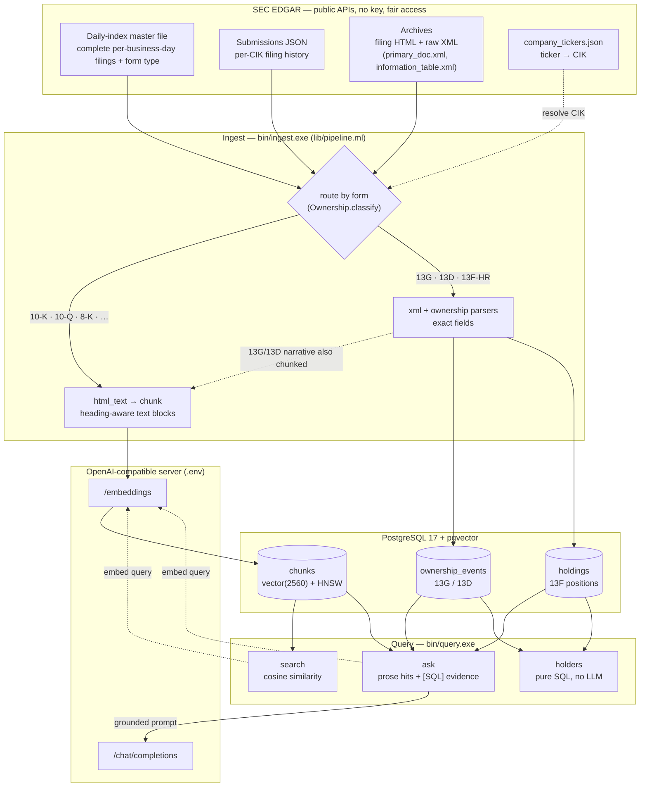

# RAGuesslighter — Retrieval-Augmented Guesslighter

Retrieval-Augmented Guesslighter over **SEC EDGAR filings**, in OCaml.

This is a pure vibe-coding proof of concept: built with Qwen 3.8 27B
under almost no supervision, primarily to see how far the model can
get on its own. Will it go further than expected?

Filings are ingested through the official public EDGAR APIs (no key,
fair access policy), then take **two paths**: narrative filings
(10-K/10-Q/8-K/…) become embedded chunks for vector search and
grounded LLM answers; ownership filings (13G/13D/13F-HR) are parsed
from their raw SEC XML into relational tables and answered with
exact SQL — with `ask` blending both when the question is
ownership-shaped. Everything is stored in **PostgreSQL/pgvector** and
inference runs against any **OpenAI-compatible** server (vLLM,
ninfer, llama.cpp, or the cloud).



## Documentation

The docs follow the [Diátaxis](https://diataxis.fr) framework —
[**start here**](docs/index.md):

| You want to… | Read |
|---|---|
| learn, by doing | [Tutorial: your first ingest and first question](docs/tutorials/first-ingest.md) |
| get something done | [How-to guides](docs/index.md) |
| look up the exact flag / setting / column | [Reference](docs/index.md) |
| understand the design | [Explanation](docs/index.md) |

## Quickstart

```sh
# 1. prerequisites: OCaml 5.5.0 (opam switch `raguesslighter`), podman,
#    a running OpenAI-compatible server for chat + embeddings

# 2. database (Postgres 17 + pgvector; schema runs on first init)
podman compose up -d

# 3. configuration
cp .env.example .env       # then edit: SEC_USER_AGENT, OPENAI_BASE_URL, models

# 4. build
dune build

# 5. ingest one company (narrative + ownership filings)
dune exec bin/ingest.exe -- ticker NVDA

# 6. ask it something
dune exec bin/query.exe -- ask "What risks does NVDA disclose about China export controls?"
dune exec bin/query.exe -- ask "What percentage of Nebius does NVIDIA own?"
dune exec bin/query.exe -- holders --subject NBIS
```

## Requirements

- **OCaml 5.5.0** + dune ≥ 3.20 (opam switch `raguesslighter`,
  `opam switch .` to install from `raguesslighter.opam`).
- **PostgreSQL 17 + pgvector** — a ready podman stack is provided
  (`compose.yaml`).
- **Any OpenAI-compatible server** for chat + embeddings
  (`OPENAI_BASE_URL`); the app only speaks HTTP to it.

## Project layout

```
bin/    ingest.exe, query.exe (cmdliner CLIs)
lib/    config, net, gz, date, edgar (discovery + parsing), html_text,
       chunk, openai, json, xml (minimal XML walker), ownership
       (13G/13D/13F parsers), store (pgvector), pipeline
schema/ 0001_init.sql (chunks + HNSW), 0002_ownership.sql
test/   unit + e2e tests, mock HTTP servers, captured fixtures/
docs/   Diátaxis docs: tutorials/, how-to/, reference/, explanation/, adr/
vendor/ vendored SQL-query ppx (rapper)
```

## Notes

- **SEC fair access**: static `SEC_USER_AGENT` with contact info,
  ≤ 10 req/s, no API key.
- **Embedding dimension**: `EMBEDDING_DIM` must match the
  `vector(N)` column in `schema/0001_init.sql` (2560 =
  qwen3-embedding-4b; HNSW only when N ≤ 2000).
- **No in-process models**: inference is entirely behind
  `OPENAI_BASE_URL`; swapping servers changes one line in `.env`.